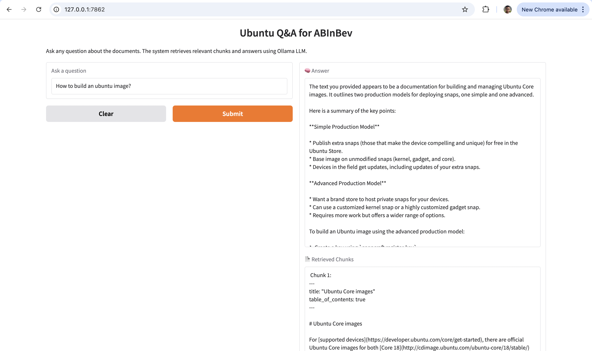
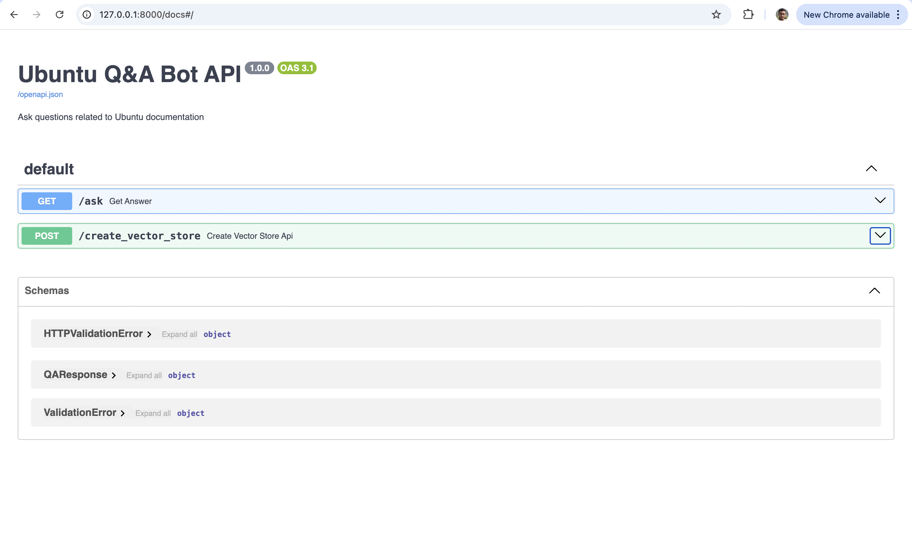

# 🧠 QA Bot App

This project provides a question-answering interface using LLMs and vector search powered by FastAPI, Ollama, gradio and Docker.

## Demo Video

[▶️ Watch the Demo Video with Docker](https://drive.google.com/file/d/1-oRpWMy8Ervl-kPosSTSAztmAUDSCMwk/view?usp=sharing)
[▶️ Watch the Demo Video with Gradio UI](https://drive.google.com/file/d/1yk1YOLvSsS_b9PNn3AXJc7i6LX0XB_wY/view?usp=sharing)
[▶️ Watch the Demo Video with Swagger UI](https://drive.google.com/file/d/1X83xA5Vn0XMaIv31DsvC5y283HtRhmGe/view?usp=sharing)

## 📦 Installation

### 1. Clone the Repository

```
git clone https://github.com/your-username/qa-bot-app.git
cd qa-bot-app
```

### 2. Install Dependencies

```
pip install -r requirements.txt
```

If not listed, install directly:

```
pip install sentence-transformers
```

## 🚀 Run Locally (Development)

### 1. Start FastAPI Server

```
uvicorn main:app --reload
```

### 2. If Port 8000 is Occupied
Check which process is using it:

```
lsof -i :8000
```

Kill the process:

```
kill -9 <PID>
```

Then re-run:

```
uvicorn main:app --reload
```

## 🐳 Docker Setup

### 1. Build Docker Image

```
docker build -t qa-bot-app .
```

### 2. Run Container

```
docker run -d -p 8001:8001 qa-bot-app
```

Optional (with volume mount for logs):

```
docker run -d \
  -p 8001:8001 \
  -v $(pwd)/logs:/app/logs \
  qa-bot-app
```

## 🔍 Debugging Docker

### View Logs

```
docker logs -f <container_name_or_id>
```

### Open Shell Inside Container

```
docker run -it --entrypoint /bin/bash qa-bot-app
```

## 🧹 Clean Up Docker

### Stop & Remove All Containers

```
docker stop $(docker ps -q)
docker rm $(docker ps -aq)
```

### Remove Specific Image

```
docker rmi <image_id>
```

## 🛠️ Useful Docker Commands

* List running containers:

```
docker ps
```

* List all images:

```
docker images
```

* Inspect container command:

```
docker inspect <container_name> | grep -A 5 Cmd
```


## 🔧 Ollama Installation & LLaMA 3.2 Setup

### 🧱 Install Ollama

On macOS or Linux (via curl):

```
curl -fsSL https://ollama.com/install.sh | sh
```

On Windows:

Download and install from the official Ollama website.

### 🦙 Run LLaMA 3.2 with Ollama

Ollama supports various models including LLaMA. To run LLaMA 3.2, pull the model:

```
ollama pull llama3
```

To run the model:

```
ollama run llama3
```

This will download and start the Meta LLaMA 3.2 model locally via Ollama. Once started, you can make requests using the local API at http://localhost:11434.

## Chunking Strategy

**impmplemented** - Overlapping Chunking (Chunks are created with overlapping content, so context is preserved between adjacent chunks.)

**Future implementations** - Hybrid chunking(Semantic + Keyword based + overlapping)

---

## What are the best and fast ways to parse the documents?

- Parallel / Batched Parsing for Many Files  
- Using generators for large files.  
- Incremental Parsing for Streaming Data  
- Regular Expressions  
- Large Language Models based parsing with parallel processing and chunking. It is helpful in understanding unstructured data and complex documents.


## Screenshots

### RAG Gradio UI


### RAG Swagger UI



